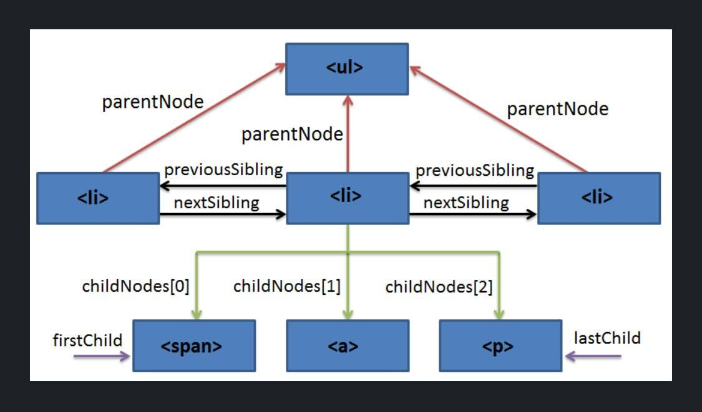

# SPA - DOM - 03

**Yesterday**
- SPA intro
- Getting some elements
- Working with the ClassList (add, remove, forEach)
- Window (alert, prompt)
- document.getElementById()

**Today**
- Traversing the DOM tree
- Manipulating elements

## Mini recap, DOM traversal and manipulation

- Who can tell me about the window object? 
- Who can tell me about the document object?

> The Window represents a window containing a DOM document
> The document property of window is DOM document loaded in that window
> https://developer.mozilla.org/en-US/docs/Web/API/Window

- Today we will mostly practice more DOM techniques
- JavaScript can do anything in the browser
- But it takes time to get used to it and to practice the techniques

- When I say DOM traversal, what do you think?
    - Targeting different elements on the DOM tree
    - Moving from element to element
        - Element to parent
        - Element to child element(s)
        - Element to sibling
        - etc
    - 

- When I say DOM manipulation, what do you think?
    - Changing the DOM using JavaScript
    - removing elements, creating elements
    - editing innerText
    - etc

- [Live coding](SPA-DOM-03-15.02.2023.html)
