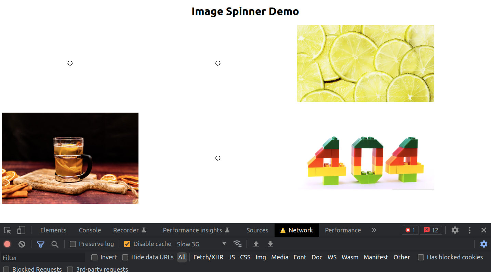

# Image Spinner

## Vorbereitung

- Führe `npm install` aus nach dem Clonen.

## Aufgaben

- In der Datei `imageLinks.js` ist ein Array aus Bildlinks.
- Importiere das Array in `App.js`.
- Erstelle eine `ImgItem`-Komponente für jedes einzelne Bild.
- Mappe durch das Array aus Bildlinks in `App.js` und rendere für jedes Bild eine `ImgItem`-Komponente.
- Solange das Bild noch nicht fertig geladen ist, soll ein Spinner angezeigt werden. Nachdem das Bild geladen ist, wird es angezeigt.
- Importiere dafür `spinner-solid.svg` aus dem `images`-Verzeichnis in die `ImgItem`-Komponente (von [fontawesome](https://fontawesome.com/icons/spinner?s=solid&f=classic). Du kannst auch jedes andere Bild nehmen).
- Benutze `useState`, das synthetische Event `onLoad` und CSS, um je nach State das Bild oder den Spinner zu verstecken.
- Benutze CSS animation mit `@keyframes`, um den Spinner rotieren zu lassen (engl. rotate).
- Style beim Bedarf mit mehr CSS.

## So testest du:

- Öffne das Browser-Devtool, gehe auf den "Network"-Tab.
- Wähle unter "throttling" eine langsame Verbindung, z.B. "Slow 3G".
- Setze das Häckchen bei "Disable cache".
- Aktualisiere die Seite.

## Referenzbild

