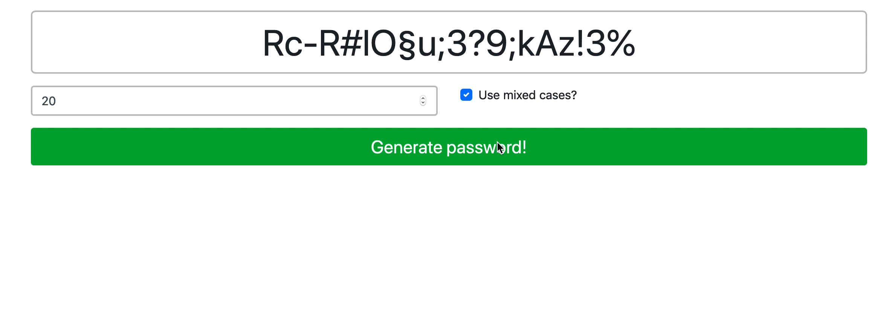

# Password Generator

Create an app to generate passwords. There should be a **Generate Password** button that creates a random password using different characters.

Don't change `index.html`, change only `js/index.js`.



## Steps

1. Use the following variable `charset` in your function (you can copy it from here).

    ```javascript
    const charset = 'abcdefghijklmnopqrstuvwxyz0123456789!§$%&/()=?#,;.:_'
    ```

3. Create that a function called `createPassword`

4. Add a `click` event listener to the `button` element that will call your createPassword function

5. Add logic to `createPassword`
    - Save the value of `#length` to a variable called `length`
    - Save the value of `#mixedCases` to a variable called `mixed`
        - NOTE: a checkbox value is tricky to read, might have to Google...
    - Create a mutable variable (a variable that can change) called `passwd`
    - Create a loop that adds `length` amount of characters to the `passwd`
        - Each time in the loop adds a random character from `charset` into `passwd`
        - If `mixedCase` is true, make every other letter uppercase
            - You can also do this randomly, if you want
            - Hint: `"a".toUpperCase()` and `"%".toUpperCase()` both work
    - Write the generated password inside of the `#output` element

6. Generate the first password as soon as the page is loaded

Examples for generated passwords: 
    - `876FocMkcCv98teXc(Ov`
    - `%lfXcrLt-#ke3r6R5§-?`
    - `Nd1Z\$yRx`